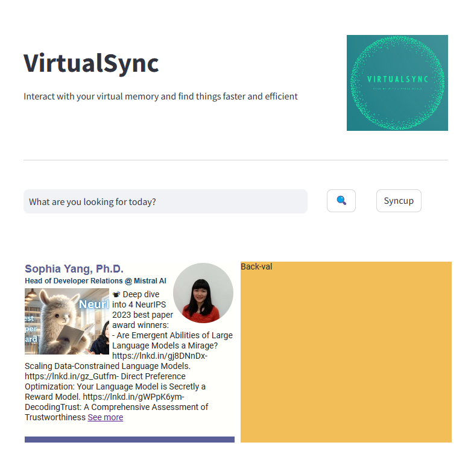

### VirtualSync

The idea of the project is to build a RAG pipeline for virtual memories ie, items saved during browsing or in a social media app. Unfortuantely, currently no one - meta, linkedin - provides api access to saved-items.

- The project first scrape user linkedin save posts and dump the incremental new saved items to rest db - nosql database.
- Using the search query, we build a RAG pipeline on top of the scrapped data.
- Matched items are returned as flipable card view.
- The whole implementation is using Streamlit, HTML/CSS. JS

I am currently taking a break from the project as the selenium driver are behaing differently on dpeloyed state.
